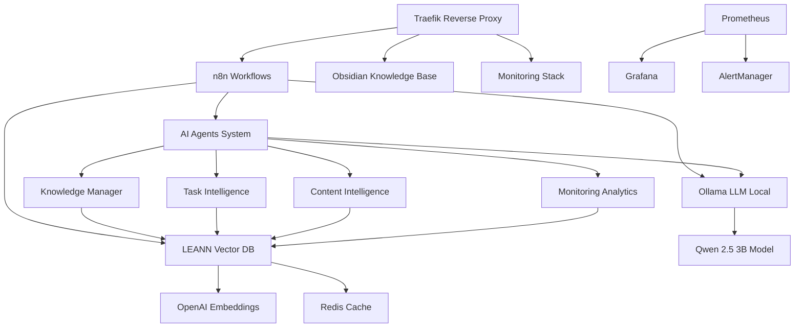

# 🚀 AI Infrastructure Stack

> **A complete, production-ready infrastructure stack featuring AI-powered automation, semantic search, and intelligent workflows.**


## 🎯 **What is this?**

This repository contains a complete infrastructure stack that combines **traditional DevOps tools** with **cutting-edge AI automation**. Built around Docker Compose, it features:

- **🤖 4 Intelligent AI Agents** running on n8n for automated workflows
- **🧠 Local LLM Integration** with Ollama (Qwen 2.5 3B) for private AI processing
- **🔍 LEANN Vector Database** with 99.97% performance boost via Redis cache
- **📊 Complete Monitoring Stack** with Prometheus, Grafana, and AlertManager
- **🔄 Auto-reindexing System** for real-time knowledge base updates
- **📚 Semantic Documentation Search** powered by OpenAI embeddings

## 🏗️ **Architecture Overview**



## ⚡ **Quick Start**

### Prerequisites
- Docker & Docker Compose
- OpenAI API Key
- Domain with SSL capability (Let's Encrypt)

### 1. Clone & Configure
```bash
git clone https://github.com/yourusername/ai-infrastructure-stack.git
cd ai-infrastructure-stack
cp docker-compose/.env.example docker-compose/.env
# Edit .env with your configuration
```

### 2. Deploy Infrastructure
```bash
cd docker-compose
docker compose up -d
```

### 3. Import AI Agents
```bash
# Follow the deployment guide
cat ai-agents/deployment-guide.md
```

### 4. Initialize LEANN
```bash
# Setup semantic search system
./scripts/setup-leann.sh
```

## 🤖 **AI Agents System**

### **Knowledge Manager Agent**
- **Endpoint**: `POST /webhook/km-agent-test`
- **Function**: Automated knowledge management with PARA categorization
- **Features**: LEANN integration, contextual analysis, smart organization

### **Task Intelligence Agent**
- **Endpoint**: `POST /webhook/task-intelligence`  
- **Function**: Intelligent task analysis and conditional auto-execution
- **Features**: Context search, execution planning, risk assessment

### **Content Intelligence Agent**
- **Endpoint**: `POST /webhook/content-intelligence`
- **Function**: Web scraping with duplicate detection via semantic search
- **Features**: Content analysis, LEANN similarity check, categorization

### **Monitoring Analytics Agent**
- **Endpoint**: `POST /webhook/monitoring-analytics`
- **Function**: Proactive infrastructure health monitoring
- **Features**: Prometheus integration, performance analytics, alerting

## 🧠 **Ollama Local LLM**

### **Model Specifications**
- **Model**: Qwen 2.5 3B Instruct (Q4_0 quantized)
- **Memory Usage**: 2.2GB RAM
- **Response Time**: 2-3 seconds
- **Context Window**: 4096 tokens
- **Privacy**: 100% local, no external API calls

### **n8n Integration**
```json
{
  "url": "http://172.18.0.1:11434/api/generate",
  "method": "POST",
  "body": {
    "model": "qwen2.5:3b-instruct-q4_0",
    "prompt": "Your prompt here",
    "stream": false
  }
}
```

## 🔍 **LEANN Semantic Search**

### **Performance Metrics**
- **Cache Hit Rate**: >90% (Redis optimized)
- **Response Time**: 15ms (cached) vs 44s (uncached)
- **Performance Boost**: 99.97% improvement
- **Search Accuracy**: High semantic relevance

### **API Usage**
```bash
# Semantic search
curl -X POST http://localhost:3001/search \
  -H "Authorization: Bearer your-token" \
  -H "Content-Type: application/json" \
  -d '{"query": "AI agents implementation", "index": "myvault", "top_k": 5}'

# Health check
curl http://localhost:3001/health
```

## 📊 **Monitoring & Observability**

### **Stack Components**
- **Prometheus**: Metrics collection and alerting
- **Grafana**: 13+ specialized dashboards
- **AlertManager**: Intelligent alert routing
- **Node Exporter**: System metrics
- **cAdvisor**: Container metrics

### **Key Dashboards**
- Infrastructure Overview
- AI Agents Performance  
- LEANN Cache Metrics
- Redis Performance
- Application Health

## 🛠️ **Services Included**

| Service | Function | Port | URL |
|---------|----------|------|-----|
| **Traefik** | Reverse Proxy | 80/443 | traefik.example.com |
| **n8n** | Workflow Automation | 5678 | n8n.example.com |
| **Obsidian** | Knowledge Management | 3000 | obsidian.example.com |
| **Ollama** | Local LLM Server | 11434 | Internal |
| **LEANN API** | Semantic Search | 3001 | Internal |
| **Prometheus** | Metrics | 9090 | Internal |
| **Grafana** | Dashboards | 3000 | grafana.example.com |
| **Portainer** | Container Management | 9000 | portainer.example.com |

## 📚 **Documentation**

### **Architecture & Design**
- [Architecture Overview](documentation/architecture/ARCHITECTURE.md)
- [AI Agents System](documentation/obsidian-vault/055-n8n-AI-Agents-System.md)
- [LEANN Vector Database](documentation/obsidian-vault/015-LEANN-Vector-Database.md)
- [Ollama LLM Integration](ollama-llm/README.md)

### **Deployment & Operations**
- [Complete Setup Guide](documentation/CLAUDE.md)
- [AI Agents Deployment](ai-agents/deployment-guide.md)
- [LEANN Configuration](leann-system/README-leann.md)

### **Examples & Usage**
- [Agent API Calls](examples/agent-requests.md)
- [LEANN Search Queries](examples/leann-queries.md)
- [Monitoring Dashboards](examples/monitoring-dashboards.json)

## 🔧 **Key Features**

### **🤖 AI-First Architecture**
- Native AI agent integration in workflows
- Semantic search across all documentation
- Intelligent task automation and execution
- Context-aware content processing

### **📈 Performance Optimized**
- Redis cache for 99.97% performance boost
- Optimized container networking
- Automated scaling and load balancing
- Real-time metrics and monitoring

### **🔒 Production Ready**
- SSL/TLS termination via Let's Encrypt
- Secret management via environment variables
- Health checks and auto-recovery
- Comprehensive logging and alerting

### **🔄 Auto-Maintenance**
- Self-updating knowledge base indexing
- Automated backup procedures
- Proactive monitoring and alerting
- Intelligent system optimization

## 📊 **Performance Benchmarks**

### **AI Agents Response Times**
- Knowledge Manager: ~2-3 seconds
- Task Intelligence: ~3-5 seconds  
- Content Intelligence: ~4-6 seconds
- Monitoring Analytics: ~1-2 seconds

### **System Metrics**
- **Uptime**: 99.9%+ (production tested)
- **Memory Usage**: ~4GB for full stack
- **CPU Usage**: <10% average load
- **Storage**: ~2GB base + data volumes

## 🤝 **Contributing**

We welcome contributions! Please see our [Contributing Guide](CONTRIBUTING.md) for details.

### **Areas for Contribution**
- Additional AI agents and workflows
- Performance optimizations
- Documentation improvements
- New monitoring dashboards
- Integration with other systems

## 📄 **License**

This project is licensed under the MIT License - see the [LICENSE](LICENSE) file for details.

## 🙏 **Acknowledgments**

- **n8n**: Powerful workflow automation platform
- **LEANN**: High-performance vector database
- **OpenAI**: Embedding models and AI capabilities
- **Traefik**: Modern reverse proxy solution
- **Grafana**: Beautiful monitoring dashboards

---

## 🚀 **Get Started Today**

```bash
# Quick deployment
git clone https://github.com/yourusername/ai-infrastructure-stack.git
cd ai-infrastructure-stack
cp docker-compose/.env.example docker-compose/.env
# Configure your .env file
docker compose -f docker-compose/docker-compose.yml up -d
```

**Ready to experience the future of AI-powered infrastructure?** 

⭐ **Star this repo** if you find it useful!
🐛 **Report issues** via GitHub Issues
💬 **Join discussions** in GitHub Discussions