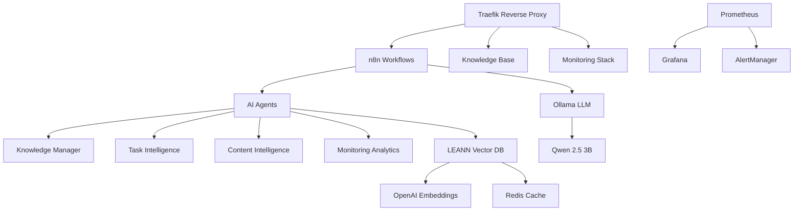

# AI Infrastructure Stack

A production-ready infrastructure stack combining DevOps tooling with AI-powered automation — semantic search, intelligent workflows, local LLM processing, and enterprise monitoring.

## Architecture


```mermaid
graph TD
    A[Traefik Reverse Proxy] --> B[n8n Workflows]
    A --> C[Knowledge Base]
    A --> D[Monitoring Stack]

    B --> E[AI Agents]
    E --> F[Knowledge Manager]
    E --> G[Task Intelligence]
    E --> H[Content Intelligence]
    E --> I[Monitoring Analytics]

    J[LEANN Vector DB] --> K[OpenAI Embeddings]
    J --> L[Redis Cache]

    P[Ollama LLM] --> Q[Qwen 2.5 3B]
    B --> P
    E --> J

    M[Prometheus] --> N[Grafana]
    M --> O[AlertManager]
```

## Components

| Service | Purpose | Port |
|---------|---------|------|
| **Traefik** | Reverse proxy + auto-SSL | 80/443 |
| **n8n** | Workflow automation + agent orchestration | 5678 |
| **Ollama** | Local LLM inference (Qwen 2.5 3B, 100% offline) | 11434 |
| **LEANN** | Vector database for semantic search | 3001 |
| **Redis** | LEANN query cache (99.97% latency reduction) | 6379 |
| **Prometheus** | Metrics collection | 9090 |
| **Grafana** | Dashboards (13+ pre-configured) | 3000 |
| **AlertManager** | Alert routing | 9093 |
| **Portainer** | Container management UI | 9000 |

## AI Agents

Four autonomous agents run on n8n, each with LEANN semantic search integration:

| Agent | Endpoint | Function |
|-------|----------|----------|
| **Knowledge Manager** | `POST /webhook/km-agent-test` | PARA-categorized knowledge ingestion with contextual analysis |
| **Task Intelligence** | `POST /webhook/task-intelligence` | Task analysis, execution planning, and conditional auto-execution |
| **Content Intelligence** | `POST /webhook/content-intelligence` | Web scraping with duplicate detection via semantic similarity |
| **Monitoring Analytics** | `POST /webhook/monitoring-analytics` | Proactive infrastructure health monitoring via Prometheus |

## LEANN Semantic Search

Vector database with OpenAI embeddings and Redis caching:

```bash
# Search
curl -X POST http://localhost:3001/search \
  -H "Authorization: Bearer $TOKEN" \
  -H "Content-Type: application/json" \
  -d '{"query": "AI agent implementation", "index": "vault", "top_k": 5}'
```

**Performance**: 15ms cached vs 44s uncached (99.97% improvement at >90% cache hit rate).

## Local LLM (Ollama)

- **Model**: Qwen 2.5 3B Instruct (Q4_0, 2.2GB RAM)
- **Response time**: 2–3 seconds
- **Privacy**: Fully local — no external API calls

## Quick Start

```bash
git clone https://github.com/fredericosanntana/ai-infrastructure-stack.git
cd ai-infrastructure-stack
cp docker-compose/.env.example docker-compose/.env
# Edit .env with your configuration
docker compose -f docker-compose/docker-compose.yml up -d
```

### Prerequisites

- Docker & Docker Compose
- OpenAI API key (for LEANN embeddings)
- Domain with DNS configured (for Traefik SSL)

## Monitoring

- **Prometheus** collects metrics from all services and containers
- **Grafana** provides 13+ dashboards: infrastructure overview, AI agent performance, LEANN cache metrics, Redis stats
- **AlertManager** routes alerts via configurable channels

## Performance

| Metric | Value |
|--------|-------|
| Full stack memory | ~4GB |
| Average CPU | <10% |
| Uptime | 99.9%+ |
| Agent response | 1–6s depending on agent |
| Storage baseline | ~2GB + data volumes |

## Documentation

- [Architecture Overview](documentation/architecture/ARCHITECTURE.md)
- [AI Agents System](documentation/obsidian-vault/055-n8n-AI-Agents-System.md)
- [LEANN Vector Database](documentation/obsidian-vault/015-LEANN-Vector-Database.md)
- [Ollama LLM Integration](ollama-llm/README.md)
- [AI Agents Deployment Guide](ai-agents/deployment-guide.md)

## License

MIT
