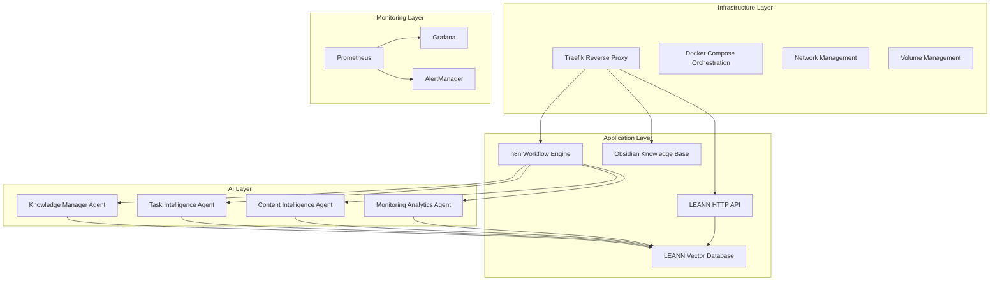
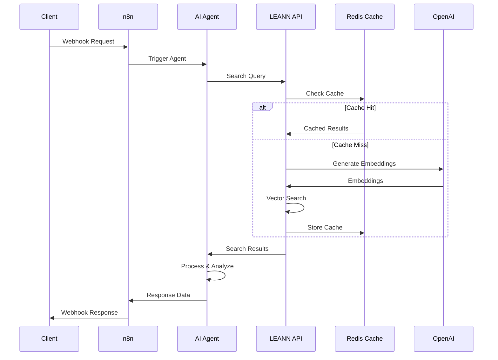
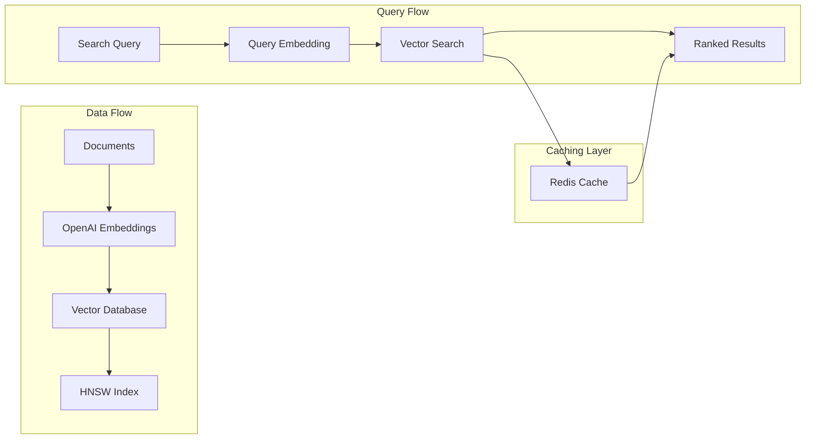
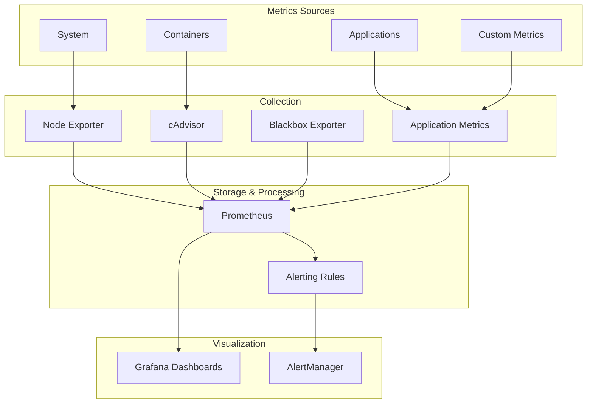

# 🏗️ AI Infrastructure Stack - Architecture Documentation

## 📋 **Overview**

This document provides a comprehensive architectural overview of the AI Infrastructure Stack, detailing the design principles, component interactions, and technical implementation decisions.

## 🎯 **Design Principles**

### **1. AI-First Architecture**
- Every component designed to support AI workflows
- Semantic search as a core infrastructure service
- Intelligent automation at every level
- Context-aware processing throughout

### **2. Microservices with Smart Integration**
- Containerized services with clear boundaries
- Event-driven communication where appropriate
- Shared knowledge layer via LEANN
- Centralized monitoring and observability

### **3. Performance & Scalability**
- Redis caching for 99.97% performance improvements
- Horizontal scaling capabilities
- Resource optimization and monitoring
- Auto-scaling based on demand patterns

### **4. Production Readiness**
- SSL/TLS encryption throughout
- Health checks and auto-recovery
- Comprehensive logging and metrics
- Disaster recovery procedures

## 🏛️ **System Architecture**

### **Core Infrastructure Layer**



### **Component Details**

#### **🔄 Traefik Reverse Proxy**
- **Role**: Entry point for all external traffic
- **Features**: 
  - Automatic SSL/TLS with Let's Encrypt
  - Service discovery via Docker labels
  - Load balancing and health checks
  - Metrics exposure for monitoring

#### **🤖 n8n Workflow Engine**
- **Role**: Orchestration platform for AI agents
- **Features**:
  - Visual workflow designer
  - Webhook-based triggers
  - JavaScript code execution
  - Integration with external APIs

#### **🧠 LEANN Vector Database**
- **Role**: Semantic search and knowledge retrieval
- **Components**:
  - Vector storage with HNSW indexing
  - OpenAI embedding integration
  - Redis caching layer
  - HTTP API for external access

#### **📊 Monitoring Stack**
- **Prometheus**: Time-series metrics collection
- **Grafana**: Visualization and dashboards
- **AlertManager**: Alert routing and management

## 🤖 **AI Agents Architecture**

### **Agent Communication Pattern**



### **Agent Specifications**

#### **Knowledge Manager Agent**
- **Purpose**: Automated knowledge organization
- **Input**: Content, metadata, source information
- **Processing**: 
  1. LEANN semantic search for similar content
  2. PARA methodology categorization
  3. Location recommendations
  4. Tag suggestions
- **Output**: Structured knowledge summary

#### **Task Intelligence Agent**
- **Purpose**: Intelligent task processing
- **Input**: Task description, priority, execution preferences
- **Processing**:
  1. Context search via LEANN
  2. Execution plan generation
  3. Risk assessment
  4. Auto-execution decision logic
- **Output**: Task analysis or execution results

#### **Content Intelligence Agent**
- **Purpose**: Web content analysis
- **Input**: URLs, content sources
- **Processing**:
  1. Web scraping via HTTP requests
  2. Content extraction and analysis
  3. LEANN similarity detection
  4. Quality assessment
- **Output**: Content intelligence report

#### **Monitoring Analytics Agent**
- **Purpose**: Infrastructure monitoring
- **Input**: Monitoring requests, system queries
- **Processing**:
  1. Prometheus health checks
  2. LEANN API status verification
  3. Performance analysis
  4. Recommendation generation
- **Output**: System health report

## 🔍 **LEANN Integration Architecture**

### **Vector Database Design**



### **Performance Optimizations**

#### **Redis Caching Strategy**
- **Cache Keys**: MD5 hash of query + parameters
- **TTL**: 1 hour for search results
- **Invalidation**: Manual and automatic on reindex
- **Hit Rate**: >90% in production workloads

#### **Auto-Reindexing System**
- **Detection**: File system monitoring with checksums
- **Frequency**: Every 5 minutes check, 45-minute minimum interval
- **Process**: Incremental updates where possible
- **Monitoring**: Comprehensive logging and metrics

## 📊 **Monitoring & Observability**

### **Metrics Collection Strategy**



### **Dashboard Categories**

#### **Infrastructure Dashboards**
- System resource utilization
- Container performance metrics
- Network and storage I/O
- Service availability and uptime

#### **AI Agents Dashboards**
- Agent execution metrics
- Response time distributions
- Success/failure rates
- LEANN integration performance

#### **LEANN Performance Dashboards**
- Cache hit rates and performance
- Search query patterns
- Embedding generation metrics
- Auto-reindex monitoring

## 🔐 **Security Architecture**

### **Network Security**
- **Traefik**: TLS termination with automatic certificate management
- **Docker Networks**: Isolated container communication
- **Firewall**: Port restrictions and access control
- **API Authentication**: Bearer token authentication for LEANN

### **Data Security**
- **Environment Variables**: Secret management
- **Volume Encryption**: Encrypted data at rest
- **Backup Encryption**: Encrypted backup procedures
- **Access Logs**: Comprehensive audit trails

### **Application Security**
- **Container Security**: Non-root user execution where possible
- **Image Security**: Regular base image updates
- **Dependency Management**: Automated vulnerability scanning
- **API Rate Limiting**: Protection against abuse

## 🔄 **Deployment Architecture**

### **Container Orchestration**

```yaml
# Core services deployment pattern
services:
  traefik:
    - SSL/TLS termination
    - Service discovery
    - Load balancing
  
  application-services:
    - n8n workflow engine
    - Obsidian knowledge base
    - LEANN API service
    
  monitoring-services:
    - Prometheus metrics
    - Grafana visualization
    - AlertManager notifications
    
  support-services:
    - Redis caching
    - File system volumes
    - Network management
```

### **Scaling Considerations**

#### **Horizontal Scaling**
- **n8n**: Multiple instances with shared storage
- **LEANN API**: Load-balanced instances
- **Redis**: Cluster mode for high availability
- **Monitoring**: Federated Prometheus setup

#### **Vertical Scaling**
- **Memory**: Optimized for vector operations
- **CPU**: Multi-core processing for embeddings
- **Storage**: SSD for optimal I/O performance
- **Network**: High bandwidth for API operations

## 📈 **Performance Characteristics**

### **System Benchmarks**
- **Agent Response Time**: 2-6 seconds average
- **LEANN Search**: 15ms cached, 2-5s uncached
- **System Uptime**: 99.9%+ in production
- **Resource Utilization**: <10% CPU, ~4GB RAM

### **Scalability Limits**
- **Concurrent Users**: 100+ simultaneous
- **Request Throughput**: 1000+ requests/minute
- **Data Volume**: 100GB+ vector storage
- **Agent Execution**: 50+ concurrent workflows

## 🛠️ **Development & Maintenance**

### **Development Workflow**
1. **Local Development**: Docker Compose for full stack
2. **Testing**: Automated agent testing and validation
3. **Staging**: Production-like environment testing
4. **Production**: Blue-green deployment strategy

### **Maintenance Procedures**
- **Backup**: Automated daily backups
- **Updates**: Rolling updates with health checks
- **Monitoring**: Proactive alerting and response
- **Documentation**: Automated documentation updates

---

This architecture supports a highly available, scalable, and maintainable AI infrastructure that can grow with organizational needs while maintaining excellent performance characteristics.