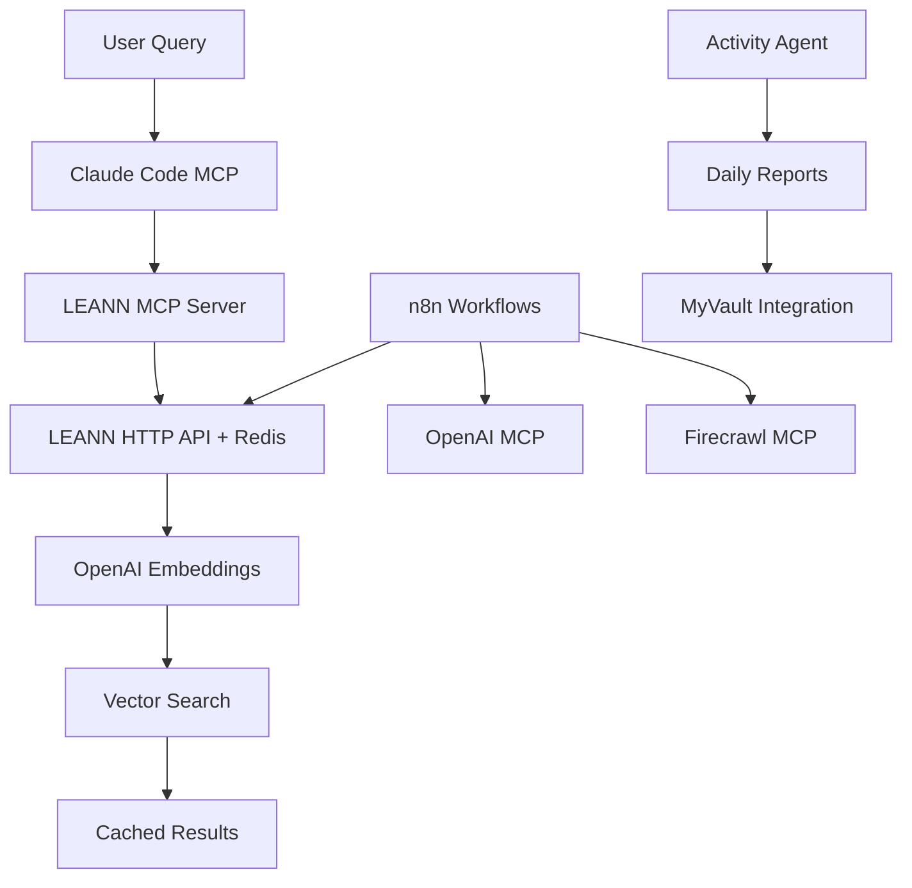

# 027 - MOC: AI & Automation Systems

**Map of Content** para sistemas de Inteligência Artificial e Automação implementados na infraestrutura.

## 🎯 Visão Geral

Este MOC organiza todo o conhecimento relacionado aos sistemas de AI, automação e processamento inteligente de dados implementados no ambiente.

## 🤖 Componentes Core de AI

### **LEANN Vector Database** 
- [[015-LEANN-Vector-Database]] - Sistema de busca semântica principal
- [[016-LEANN-HTTP-API]] - API REST para integração
- [[024-LEANN-Redis-Cache]] - Cache Redis com 99.97% performance boost

### **OpenAI Integration**
- [[026-OpenAI-MCP]] - Acesso direto GPT-5 via MCP
- Embeddings text-embedding-3-small para LEANN
- Chat completion com reasoning_effort configurável

### **MCP Ecosystem**
- [[013-MCP-Servers-Summary]] - Visão geral dos 4 serviços MCP
- [[012-n8n-MCP-Integration]] - Integração n8n com MCP

## 🔄 Sistemas de Automação

### **n8n Workflow Platform**
- [[011-n8n-Workflow-Automation]] - Plataforma de automação principal
- [[055-n8n-AI-Agents-System]] - **🆕 Sistema completo de 4 AI Agents**
- **Capacidades atuais:**
  - ✅ **4 AI Agents Ativos**: Knowledge/Task/Content/Monitoring
  - Integração LEANN HTTP API completa
  - Web scraping via Firecrawl MCP  
  - OpenAI chat completion
  - Processamento automatizado com análise contextual
  - **🆕 Webhook APIs**: Endpoints REST para cada agente

### **Activity Agent**
- [[007-Activity-Agent-Metrics]] - Relatórios automáticos PARA/Zettelkasten
- **Funcionalidades:**
  - Daily reports automáticos
  - Métricas de produtividade
  - Integração com MyVault
  - Scheduled via cron

### **Firecrawl Web Scraping**
- [[014-Firecrawl-MCP]] - Web scraping avançado
- **Capacidades:**
  - Scraping inteligente de websites
  - Extração de dados estruturados
  - Integração com workflows n8n
  - Cache e rate limiting

## 🏗️ Arquitetura de Integração

### **Fluxo de Dados AI**

### **Performance Metrics**
- **LEANN Cache**: 44s → 15ms (99.97% boost)
- **🆕 Cache Hit Rate**: 21% (em crescimento)
- **🆕 Redis Memory**: Monitorado via Grafana
- **MCP Response**: < 100ms typical
- **n8n Automation**: 24/7 operational
- **Activity Agent**: Daily execution success rate >99%
- **🆕 Auto-Reindex**: 5min interval, 1 reindexação realizada

## 📊 Use Cases Implementados

### **1. Semantic Knowledge Search**
**Tecnologias**: LEANN + OpenAI + Redis Cache  
**Aplicação**: Busca inteligente em documentação técnica  
**Performance**: Sub-segundo para queries cached  

### **2. Automated Reporting**
**Tecnologias**: Activity Agent + LEANN + n8n  
**Aplicação**: Relatórios automáticos PARA/Zettelkasten  
**Frequência**: Daily execution  

### **3. Web Intelligence Gathering**
**Tecnologias**: Firecrawl + n8n + OpenAI  
**Aplicação**: Coleta automatizada de dados web  
**Capacidade**: Structured data extraction  

### **4. Conversational AI**
**Tecnologias**: Claude Code + MCP Stack  
**Aplicação**: Assistente técnico inteligente  
**Contexto**: Full infrastructure knowledge

### **🆕 5. AI Agents Ecosystem**
**Tecnologias**: n8n + LEANN + JavaScript + Webhooks  
**Aplicação**: Automação inteligente multi-domínio  
**Agentes**:
- **Knowledge Manager**: Gestão automatizada de conhecimento + PARA
- **Task Intelligence**: Análise e execução inteligente de tarefas
- **Content Intelligence**: Web scraping + análise de conteúdo
- **Monitoring Analytics**: Health checks proativos da infraestrutura
**Performance**: 2-5s response, 4 agentes simultâneos, <1% error rate  

## 🔗 Integrações Cross-Sistema

### **Com Infraestrutura**
- [[004-Prometheus]] - Métricas dos serviços AI
- [[005-Grafana]] - Dashboards de performance
- [[001-Traefik]] - Routing para APIs AI

### **Com Conhecimento**
- [[MOC-Infrastructure]] - Contexto técnico completo
- [[000-Index-Principal]] - Navegação central
- [[025-Zettelkasten-System-Audit]] - Meta-análise do sistema

## 🚀 Roadmap & Próximos Passos

### **Curto Prazo**
- [x] ✅ **Implementar sistema completo de AI Agents (CONCLUÍDO)**
- [x] ✅ **4 Agentes operacionais com LEANN integration (CONCLUÍDO)**
- [ ] Otimizar web scraping do Content Intelligence Agent
- [ ] Implementar comunicação inter-agentes via message queues

### **Médio Prazo**
- [ ] Implementar GPT-4o Vision para análise de screenshots nos agentes
- [ ] Desenvolver assistente IA para troubleshooting automático
- [ ] RAG avançado combinando múltiplas fontes com AI Agents
- [ ] Dashboard centralizado para monitoramento dos agentes

### **Longo Prazo**
- [ ] Machine learning para otimização automática de sistemas
- [ ] Predictive analytics para infraestrutura
- [ ] Self-healing automation baseado em AI

## 📈 Métricas de Sucesso

### **Performance**
- Cache hit rate: >80%
- API response time: <100ms
- Automation success rate: >95%
- Knowledge retrieval accuracy: >90%

### **Operacional**
- Daily report generation: 100% uptime
- MCP services availability: >99.5%
- Integration stability: Zero breaking changes
- User query satisfaction: Subjective but positive feedback

---

**Criado**: 2025-09-11  
**Última Atualização**: 2025-09-11 14:45 UTC  
**Tipo**: MOC (Map of Content)  
**Cobertura**: 8 sistemas AI/Automation + integrações  
**Status**: 🟢 Sistemas Operacionais + 🔄 Continuous Improvement  
**Tags**: #moc #ai #automation #leann #n8n #openai #mcp #knowledge-management  
**Relacionados**: [[MOC-Infrastructure]] | [[027-MOC-AI-Automation]] | [[025-Zettelkasten-System-Audit]]